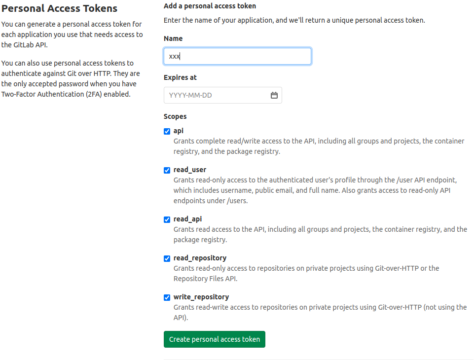

# Private Repository Setting

```
go env -w GO111MODULE=on
go env -w GOPROXY=https://goproxy.cn,direct
go env -w GOPRIVATE="$domain"

git config --global url.ssh://git@$domain/.insteadOf https://$domain/
```

**`$domain` is repositories's domain.**

## Subgroup

Ignore this step If private repository hasn't subgroup.

Add file `~/.netrc`

```
machine $domain
login $name
password $password
```

**`$domain` is repositories's domain.**
**`$name` is repositories's login name.**
**`$password` is repositories's login password or access token(not ssh key).**

### Gitlab Access Token Generate

1. Open repository, find access token setting(for example:https://gitlab.com/profile/personal_access_tokens).
2. Filling name add check all.
   
3. Create
