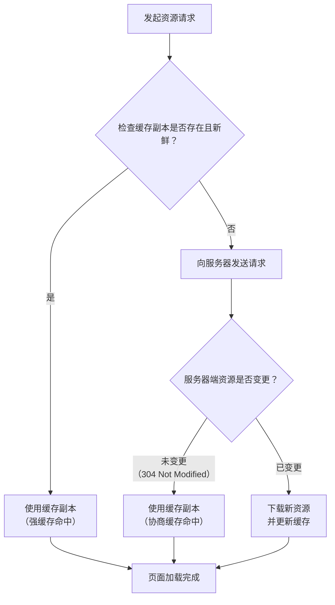

# 浏览器相关

### 一、 什么是浏览器缓存？

简单来说，**浏览器缓存是一种在本地磁盘存储资源副本的技术**。

当你第一次访问一个网站时，浏览器会下载该网站的各种资源，比如 HTML 文档、CSS 样式表、JavaScript 脚本、图片、字体等。为了避免你下次访问同一网站时重复下载这些不变的资源，浏览器会将这些文件“缓存”（即保存）在你的电脑硬盘上。

**核心目的：**

- **加速页面加载**：从本地磁盘加载资源远比从网络服务器下载要快得多，从而提升用户体验。
- **减少网络带宽消耗**：减少了不必要的网络请求，为用户节省流量，也为服务器减轻了压力。
- **降低服务器负载**：更少的请求意味着服务器需要处理的负载更小。

---

### 二、 浏览器缓存的工作原理：关键步骤

浏览器在处理缓存时，主要遵循以下流程，其核心是 **缓存检查机制**：



如上图所示，浏览器的缓存策略可以分为两个主要阶段：

#### 阶段一：强缓存

这是浏览器的**第一道检查**。在真正向服务器发送请求之前，浏览器会先检查本地缓存副本是否“新鲜”。

- **如何判断是否新鲜？** 浏览器通过查看缓存资源响应头中的两个字段来判断：

  - `Cache-Control` (HTTP/1.1, **优先级更高**)
    - `max-age=`： 资源的最大存活时间（单位：秒）。例如 `max-age=31536000` 表示资源在一年内都是新鲜的。
    - `no-cache`： **不是不缓存**，而是**禁止使用强缓存**。每次使用缓存前，必须向服务器验证（即跳到阶段二）。
    - `no-store`： **真正的不缓存**。禁止存储任何关于客户端请求和服务端响应的内容。
    - `public`： 允许所有用户（客户端和代理服务器）缓存。
    - `private`： 只允许最终用户（浏览器）缓存，代理服务器不能缓存。
  - `Expires` (HTTP/1.0, 已被 `Cache-Control` 取代)
    - 指定一个绝对的过期时间（GMT 格式）。如果本地时间超过这个时间，则缓存过期。

- **结果**：
  - **强缓存命中**：如果缓存未过期（新鲜），浏览器会**直接使用本地缓存**，**完全不会向服务器发送请求**。在开发者工具的 Network 面板中，你会看到状态码 `200 (from disk cache)` 或 `200 (from memory cache)`。
  - **强缓存未命中**：如果缓存已过期，浏览器则进入下一阶段——**协商缓存**。

#### 阶段二：协商缓存

当强缓存失效后，浏览器**会向服务器发送请求**，但这次请求的目的是“询问”服务器本地缓存是否还能继续使用。

- **如何“询问”？** 浏览器会在请求头中携带一些“证据”给服务器。

  - **Last-Modified / If-Modified-Since**:
    - 服务器在**第一次**返回资源时，会在响应头中带上 `Last-Modified`，表示该资源的最后修改时间。
    - 当浏览器再次请求该资源时，会在请求头中带上 `If-Modified-Since`，其值就是之前收到的 `Last-Modified`。
    - 服务器收到后，对比资源的当前最后修改时间和 `If-Modified-Since` 的值。
  - **ETag / If-None-Match** (优先级更高)：
    - 服务器在**第一次**返回资源时，会在响应头中生成一个唯一标识符 `ETag`（通常是文件的哈希值）。
    - 当浏览器再次请求该资源时，会在请求头中带上 `If-None-Match`，其值就是之前收到的 `ETag`。
    - 服务器收到后，计算当前资源的 `ETag` 并与之对比。

- **结果**：
  - **协商缓存命中**：如果服务器对比后发现资源没有变化（`If-None-Match` 匹配或 `If-Modified-Since` 时间后未修改），则会返回一个 **`304 Not Modified`** 的响应，**响应体为空**。浏览器收到 304 后，就知道本地缓存仍然有效，于是使用本地缓存。
  - **协商缓存未命中**：如果资源已经变化，服务器会返回一个完整的 **`200 OK`** 响应，并在响应体中包含最新的资源内容。浏览器会使用新资源，并更新本地缓存。

---

### 三、 缓存位置

浏览器缓存通常存储在两个地方：

- **Memory Cache (内存缓存)**：读取速度快，但生命周期短，随进程释放（关闭标签页或浏览器可能会清空）。
- **Disk Cache (磁盘缓存)**：读取速度比内存慢，但容量大、存储时间长。

浏览器会自动决定将资源放在哪里。通常，大文件、不常访问的文件会进入磁盘，当前会话高频使用的资源会放在内存。

---

### 四、 实践与应用

#### 1. 对于普通用户

- **如何强制刷新/清除缓存？**
  - **普通刷新**：按 F5 或刷新按钮。会使用强缓存和协商缓存。
  - **硬性重新加载**：按 `Ctrl + F5`。浏览器会忽略所有缓存，直接向服务器请求所有资源。
  - **清空缓存并硬性重新加载**：在开发者工具 (F12) 中，在 Network 面板上右键刷新按钮可选择。这是最彻底的清除方式。
  - 也可以在浏览器设置中清除整个浏览数据。

#### 2. 对于 Web 开发者

合理地设置缓存策略至关重要，直接影响网站性能。

- **静态资源（如图片、CSS、JS）**：通常使用**强缓存**，并设置一个很长的过期时间（例如一年：`max-age=31536000`）。为了在更新时能立即生效，通常采用“文件指纹”技术——在文件名中嵌入哈希值（如 `style.a1b2c3.css`）。文件内容变化，文件名就变化，URL 也就不同了，相当于请求一个新资源，从而绕过缓存。
- **HTML 页面**：通常使用**协商缓存**或 `no-cache`，确保用户能及时获取到最新的页面结构。
- **隐私/敏感数据**：使用 `no-store` 确保不被缓存。

**示例 HTTP 头部：**

```http
# 对静态资源设置一年强缓存
Cache-Control: public, max-age=31536000

# 对HTML设置协商缓存
Cache-Control: no-cache
# 或者
Cache-Control: max-age=0, must-revalidate
```

---

### 总结

| 特性             | 强缓存                     | 协商缓存                 |
| :--------------- | :------------------------- | :----------------------- |
| **触发条件**     | 缓存未过期                 | 强缓存失效               |
| **是否发送请求** | **否**                     | **是**                   |
| **服务器状态码** | 200 (from cache)           | 304 (Not Modified)       |
| **主要控制头**   | `Cache-Control`, `Expires` | `ETag`, `Last-Modified`  |
| **性能**         | **极高**                   | **较高**（仍需网络往返） |

浏览器缓存是一个通过**时间换空间**的经典性能优化策略，是现代 Web 架构中不可或缺的一部分。
