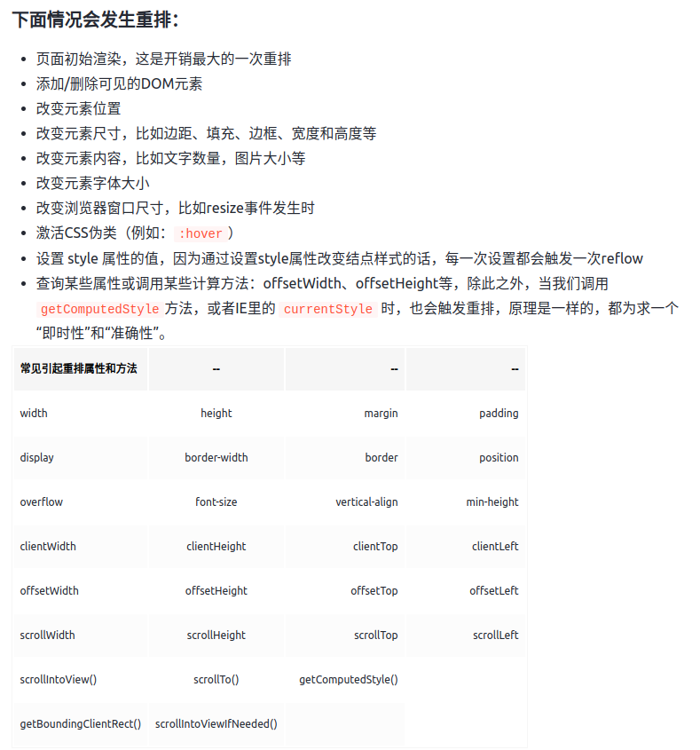
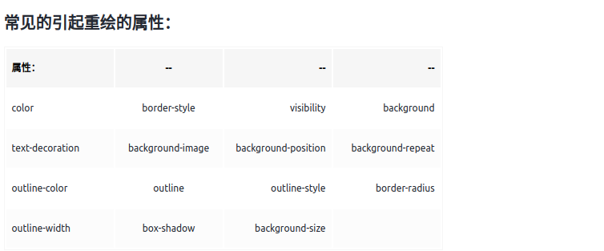

# 前端大杂烩

1. 宏任务和微任务
   首先，JS 是一个单线程的脚本语言。也就是说在一行代码执行的过程中，必然不会存在同时执行的另一行代码。
   **微任务会在宏任务之前执行；** 在当前的微任务没有执行完成时，是不会执行下一个宏任务的。
   所以一个 js 线程里边定义的微任务会优先于宏任务先执行。
   setTimeout 和 setInterval 属于宏任务。
   Promise.then 属于微任务。

   ```typescript
   setTimeout(() => console.log(0), 0);
   new Promise((r) => {
     r();
   }).then((r) => console.log(2));

   // output: 2 0
   ```

2. Promise 的优缺点
   优：a.解决 callback（回调地狱） 的问题 b.包含了更好的错误处理（异常处理） c.统一异步 API，Promise 逐渐被用作浏览器的异步 API，统一了各种各样的 API，以及不兼容的模式和手法。
   缺：a.无法取消和中断，一旦新建就会立即执行，无法中途取消 b. 如果不设置回调函数，Promise 内部抛出的错误，不会反应到外部 c.当处于 Pending 状态时，无法得知目前进展到哪一个阶段（刚刚开始还是即将结束）？ d. Promise 真正执行回调的时候，定义 Promise 那部分实际上已经执行完了，所以 Promise 的报错堆栈上下文不太友好

3. JWT 和 Oauth 的区别 [知乎](https://zhuanlan.zhihu.com/p/121630884)

   - JWT(Json Web Token) 是一种认证协议 。JWT 提供了一种用于发布接入令牌（Access Token),并对发布的签名接入令牌进行验证的方法。 令牌（Token）本身包含了一系列声明，应用程序可以根据这些声明限制用户对资源的访问。
   - JWT 一般是由三部分组成，Header + Payload + Signature。Header 部分是一个 JSON 对象，描述 JWT 的元数据；Payload 部分也是一个 JSON 对象，用来存放实际需要传递的数据。Signature 部分是对前两部分的签名，防止数据篡改。其中 Header 部分和 Payload 部分通常会采用 Base64URL 的算法进行加密。
   - Base64URL 算法与 Base64 算法的区别：Base64 有三个字符`+`、`/`和`=`，在 URL 里面有特殊含义，所以要被替换掉：`=`被省略、`+`替换成`-`，`/`替换成`_` 。这就是 Base64URL 算法。
   - OAuth2 是一种授权框架。提供了一套详细的授权机制（指导）。用户或应用可以通过公开的或私有的设置，授权第三方应用访问特定资源。比如微信授权登录。

4. 深浅拷贝

   - 浅拷贝：拷贝值或者拷贝地址，常见有 `object.assign`, `...`扩展运算符,`concat`, `slice`,`splice`
   - 深拷贝：开辟新的内存空间，将源对象的值完全拷贝到新的内存空间。常见的有 `JSON.stringify`,`手写递归拷贝`

     > JSON.stringify 缺点：a. 会忽略 `undefined`、`symbol` b. 不能序列化函数 c. 无法拷贝不可枚举的属性和对象的原型链 d. 拷贝 `RegExp` 引用类型会变成空对象，`Date` 类型会变成字符串 e. 对象中含有 `NaN`、`Infinity` 以及 `-Infinity`，`JSON` 序列化的结果会变成 `null` f. 不能解决循环引用的对象，即对象成环 (`obj[key] = obj`)

     ```js
     const isComplexDataType = (obj) =>
       (typeof obj === "object" || typeof obj === "function") && obj !== null;
     const deepClone = function (obj, hash = new WeakMap()) {
       if (obj.constructor === Date) {
         return new Date(obj); // 日期对象直接返回一个新的日期对象
       }

       if (obj.constructor === RegExp) {
         return new RegExp(obj); //正则对象直接返回一个新的正则对象
       }

       //如果循环引用了就用 weakMap 来解决
       if (hash.has(obj)) {
         return hash.get(obj);
       }
       let allDesc = Object.getOwnPropertyDescriptors(obj);

       //遍历传入参数所有键的特性
       let cloneObj = Object.create(Object.getPrototypeOf(obj), allDesc);

       // 把 cloneObj 原型复制到 obj 上
       hash.set(obj, cloneObj);

       for (let key of Reflect.ownKeys(obj)) {
         cloneObj[key] =
           isComplexDataType(obj[key]) && typeof obj[key] !== "function"
             ? deepClone(obj[key], hash)
             : obj[key];
       }
       return cloneObj;
     };
     ```

5. Proxy
   Proxy 在目标对象的外层搭建了一层拦截，外界对目标对象的某些操作，必须通过这层拦截。

   - 拦截和监视外部对对象的访问
   - 在复杂操作前对操作进行校验或对所需资源进行管理

6. 重排(reflow)、重绘(repaint)
   重排：当 DOM 的变化影响了元素的**几何信息**(元素的的位置和尺寸大小)，浏览器需要重新计算元素的几何属性，将其安放在界面中的正确位置，这个过程叫做重排。重排也叫回流，简单的说就是重新生成布局，重新排列元素。
   
   重绘：当一个元素的**外观**发生改变，但没有改变布局,重新把元素外观绘制出来的过程，叫做重绘。
   
