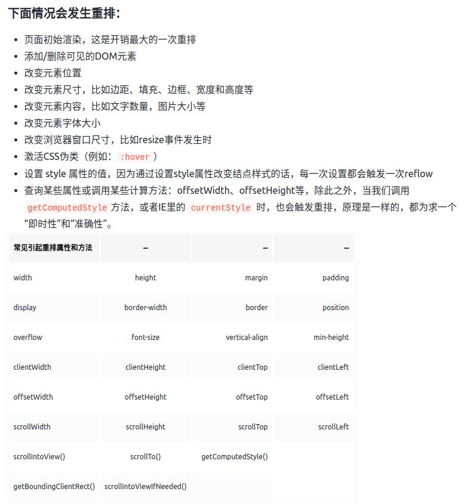
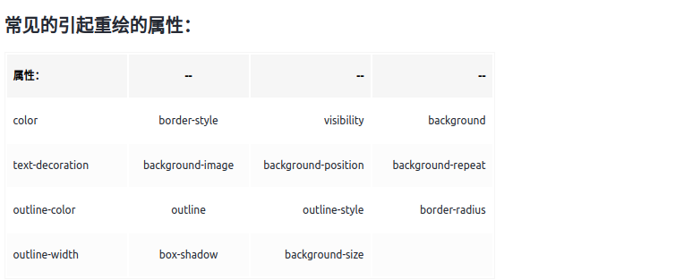

# 前端大杂烩

1. 宏任务和微任务
   首先，JS 是一个单线程的脚本语言。也就是说在一行代码执行的过程中，必然不会存在同时执行的另一行代码。
   **微任务会在宏任务之前执行；** 在当前的微任务没有执行完成时，是不会执行下一个宏任务的。
   所以一个 js 线程里边定义的微任务会优先于宏任务先执行。
   setTimeout 和 setInterval 属于宏任务。
   Promise.then 属于微任务。

   ```typescript
   setTimeout(() => console.log(0), 0);
   new Promise((r) => {
     r();
   }).then((r) => console.log(2));

   // output: 2 0
   ```

2. Promise 的优缺点
   **优**

   > a. 解决 callback（回调地狱） 的问题
   > b. 包含了更好的错误处理（异常处理）
   > c. 统一异步 API，Promise 逐渐被用作浏览器的异步 API，统一了各种各样的 API，以及不兼容的模式和手法。

   **缺**

   > a. 无法取消和中断，一旦新建就会立即执行，无法中途取消
   > b. 如果不设置回调函数，Promise 内部抛出的错误，不会反应到外部
   > c. 当处于 Pending 状态时，无法得知目前进展到哪一个阶段（刚刚开始还是即将结束）？
   > d. Promise 真正执行回调的时候，定义 Promise 那部分实际上已经执行完了，所以 Promise 的报错堆栈上下文不太友好

3. JWT 和 Oauth 的区别 [知乎](https://zhuanlan.zhihu.com/p/121630884)

   - JWT(Json Web Token) 是一种**认证协议** 。JWT 提供了一种用于发布接入令牌（Access Token),并对发布的签名接入令牌进行验证的方法。 令牌（Token）本身包含了一系列声明，应用程序可以根据这些声明限制用户对资源的访问。
   - JWT 一般是由三部分组成，**Header + Payload + Signature**。Header 部分是一个 JSON 对象，描述 JWT 的元数据；Payload 部分也是一个 JSON 对象，用来存放实际需要传递的数据。Signature 部分是对前两部分的签名，防止数据篡改。其中 Header 部分和 Payload 部分通常会采用 Base64URL 的算法进行加密。
   - Base64URL 算法与 Base64 算法的区别：Base64 有三个字符`+`、`/`和`=`，在 URL 里面有特殊含义，所以要被替换掉：`=`被省略、`+`替换成`-`，`/`替换成`_` 。这就是 Base64URL 算法。
   - OAuth2 是一种**授权框架**。提供了一套详细的授权机制（指导）。用户或应用可以通过公开的或私有的设置，授权第三方应用访问特定资源。比如微信授权登录。

4. 深浅拷贝

   - 浅拷贝：拷贝值或者拷贝地址，常见有 `object.assign`, `...`扩展运算符,`concat`, `slice`,`splice`
   - 深拷贝：开辟新的内存空间，将源对象的值完全拷贝到新的内存空间。常见的有 `JSON.stringify`,`手写递归拷贝`

     > JSON.stringify 缺点：a. 会忽略 `undefined`、`symbol` b. 不能序列化函数 c. 无法拷贝不可枚举的属性和对象的原型链 d. 拷贝 `RegExp` 引用类型会变成空对象，`Date` 类型会变成字符串 e. 对象中含有 `NaN`、`Infinity` 以及 `-Infinity`，`JSON` 序列化的结果会变成 `null` f. 不能解决循环引用的对象，即对象成环 (`obj[key] = obj`)

     ```js
     const isComplexDataType = (obj) =>
       (typeof obj === "object" || typeof obj === "function") && obj !== null;
     const deepClone = function (obj, hash = new WeakMap()) {
       if (obj.constructor === Date) {
         return new Date(obj); // 日期对象直接返回一个新的日期对象
       }

       if (obj.constructor === RegExp) {
         return new RegExp(obj); //正则对象直接返回一个新的正则对象
       }

       //如果循环引用了就用 weakMap 来解决
       if (hash.has(obj)) {
         return hash.get(obj);
       }
       let allDesc = Object.getOwnPropertyDescriptors(obj);

       //遍历传入参数所有键的特性
       let cloneObj = Object.create(Object.getPrototypeOf(obj), allDesc);

       // 把 cloneObj 原型复制到 obj 上
       hash.set(obj, cloneObj);

       for (let key of Reflect.ownKeys(obj)) {
         cloneObj[key] =
           isComplexDataType(obj[key]) && typeof obj[key] !== "function"
             ? deepClone(obj[key], hash)
             : obj[key];
       }
       return cloneObj;
     };
     ```

5. Proxy
   Proxy 在目标对象的外层搭建了一层拦截，外界对目标对象的某些操作，必须通过这层拦截。

   - 拦截和监视外部对对象的访问
   - 在复杂操作前对操作进行校验或对所需资源进行管理

6. 重排(reflow)、重绘(repaint)
   重排：当 DOM 的变化影响了元素的**几何信息**(元素的的位置和尺寸大小)，浏览器需要重新计算元素的几何属性，将其安放在界面中的正确位置，这个过程叫做重排。重排也叫回流，简单的说就是重新生成布局，重新排列元素。
   
   重绘：当一个元素的**外观**发生改变，但没有改变布局,重新把元素外观绘制出来的过程，叫做重绘。
   

7. `Math.sort` 的时间复杂度

   1. 每个浏览器内部使用的算法可能都不一样，w3c 只是规定了 api 的功能，并没有规定排序的规则
   2. chrome 在 70 版本前，使用的排序策略是：当元素个数小于 10 个的时候，使用插入排序，超过则使用快速排序； b. 70 版本后，使用了 Timsort 算法

8. `Promise.all()`、`Promise.any()`、`Promise.race()`、`Promise.allSettled()`

   > Promise.all：等待所有都完成（或第一个失败）。
   > Promise.any：等待其中任何一个完成或所有都失败。
   > Promise.race：等待其中一个完成或拒绝。
   > Promise.allSettled：等待所有都完成或者拒绝。

   **settled：敲定值（兑现或拒绝），即 `fulfilled` 和 `rejected`的统称**

9. 字体图标的压缩方法
   主要有 子集化（仅保留所需的图标）、转换为更小的格式（如 WOFF/WOFF2），以及删除不必要的字符（使用字体编辑工具）等。此外，还可以通过 预渲染 为图像格式，或使用服务器端的 Brotli/Gzip 压缩 来进一步减小文件大小。

   主流压缩方法

   - 子集化（Subsetting）：根据实际需求，只保留字体中使用的部分字符。例如，如果网页只使用拉丁字母，就不需要包含中文等其他字符，这可以显著减小文件大小。
   - 转换为 WOFF/WOFF2 格式：WOFF（Web Open Font Format）和 WOFF2 是专门为网络设计的字体格式，它们内置了压缩算法，通常比 TTF 或 OTF 格式的文件要小。WOFF2 的压缩率更高，是目前推荐的格式。
   - 使用字体编辑器删除多余图标：使用如百度字体编辑器这样的工具，打开字体文件，手动删除不需要的图标，只保留网站实际使用的图标。

   其他压缩方法

   - 预渲染为图像：对于图标字体，可以将它们预先渲染成 SVG 或 PNG 等图像格式。这种方法虽然牺牲了文本的可缩放性和可选择性，但可以消除字体加载时间。
   - 服务器端压缩：除了字体文件本身的压缩外，还可以使用服务器端通用压缩算法（如 Brotli 或 Gzip）来进一步减小字体文件在传输过程中的大小。
   - 使用在线工具：可以使用 FontSquirrel 的 Webfont Generator 等在线工具，它们通常会自动应用多种优化技术，如转换为 WOFF/WOFF2 和子集化，来压缩字体文件

10. 事件循环、微任务、宏任务
    事件循环是 JavaScript 引擎（特别是运行在浏览器和 Node.js 环境中）用来协调和处理事件、回调函数、异步任务的一种机制。它让单线程的 JavaScript 能够执行非阻塞的异步操作。
    事件循环的主要组成部分包括：

    - 调用栈（Call Stack）：用于存储同步代码和函数调用，以及它们的执行上下文。
    - 宏任务队列（Macro Task Queue）：用于存储宏任务，如 setTimeout、setInterval、I/O 操作、UI 渲染等。
    - 微任务队列（Micro Task Queue）：用于存储微任务，如 Promise 的回调函数、MutationObserver 的回调函数等。

    事件循环的工作流程大致如下：

    1. 执行同步代码，将同步代码和函数调用压入调用栈，并依次执行。当调用栈为空时，表示同步代码已经执行完毕。
    2. 检查微任务队列，如果有微任务，则依次执行微任务，直到微任务队列为空。
    3. 检查宏任务队列，如果有宏任务，则从队列中取出一个宏任务，压入调用栈并执行。执行完毕后，回到步骤 2，继续检查微任务队列和宏任务队列。
    4. 重复上述步骤，直到调用栈、微任务队列和宏任务队列为空，表示事件循环结束。

    简单的流程： 同步代码优先执行 -> 微任务全部清空 -> 渲染（如有）-> 一个宏任务 -> 回到微任务全部清空 -> ...

11. 闭包
    闭包是指有权访问另一个函数作用域中的变量的函数。闭包的形成条件是：函数嵌套、内部函数引用外部函数的变量。

12. 垃圾回收机制
    垃圾回收机制是自动内存管理的一种方式，用于回收不再使用的内存空间。常见的垃圾回收算法有标记-清除（Mark-Sweep）和引用计数（Reference Counting）。

    标记-清除算法：

    1. 标记阶段：垃圾回收器遍历堆内存，标记所有可达的对象（即从根对象出发可以到达的对象）。
    2. 清除阶段：垃圾回收器遍历堆内存，清除所有未被标记的对象，即不再使用的内存空间。

    引用计数算法：

    1. 引用计数阶段：为每个对象维护一个引用计数器，当对象被引用时，计数器加 1；当引用被解除时，计数器减 1。
    2. 回收阶段：当对象的引用计数器为 0 时，表示该对象不再被引用，可以被回收。

13. 内存泄漏
    内存泄漏是指程序中不再使用的内存空间没有被及时释放，导致内存占用不断增加，最终可能导致程序崩溃。常见的内存泄漏原因有：

    1. 全局变量：全局变量在程序运行期间不会被销毁，如果全局变量引用了大量的内存空间，可能会导致内存泄漏。
    2. 闭包：闭包会引用外部函数的变量，如果闭包没有被及时销毁，可能会导致内存泄漏。
    3. 事件监听器：事件监听器在程序运行期间不会被销毁，如果事件监听器引用了大量的内存空间，可能会导致内存泄漏。
    4. DOM 元素：DOM 元素在程序运行期间不会被销毁，如果 DOM 元素引用了大量的内存空间，可能会导致内存泄漏。

    避免内存泄漏的方法有：

    1. 避免全局变量：尽量使用局部变量，避免使用全局变量。
    2. 及时销毁闭包：及时销毁不再使用的闭包，避免闭包引用大量内存空间。
    3. 移除事件监听器：及时移除不再使用的事件监听器，避免事件监听器引用大量内存空间。
    4. 及时销毁 DOM 元素：及时销毁不再使用的 DOM 元素，避免 DOM 元素引用大量内存空间。

14. 如何处理高精度数据
    在 JavaScript 中，浮点数运算可能会产生精度问题。为了处理高精度数据，可以使用第三方库，如 BigNumber 或 Decimal.js。这些库提供了高精度的数值运算功能，可以避免浮点数运算的精度问题。例如，使用 BigNumber 库进行高精度运算：

    ```javascript
    const BigNumber = require("bignumber.js");

    const a = new BigNumber("0.1");
    const b = new BigNumber("0.2");
    const c = a.plus(b);

    console.log(c.toString()); // 输出 "0.3"
    ```

15. JS 为何会出现精度丢失
    JavaScript 出现精度丢失是因为它使用 IEEE 754 标准的双精度浮点数 来存储所有数字。这种表示法在二进制中无法精确表示某些十进制小数，例如 \(0.1\)。在转换为二进制进行存储和计算时，会产生近似值并截断多余的位数，从而导致精度丢失。 
    主要原因

    - 二进制转换问题： 许多十进制小数（如 \(0.1\) 和 \(0.2\)）在转换为二进制时会变成**无限循环小数**。
    - 存储位数限制： 由于存储位数有限（用于尾数的只有 52 位），计算机无法存储这些无限循环的小数，只能截断并存储一个近似值。
    - 浮点运算误差： 在进行计算（如加法）时，这些近似值相加后会产生一个额外的误差，导致结果不是预期的精确值，例如 \(0.1+0.2\) 的结果是 \(0.30000000000000004\)

16. SEO 方案
    SEO（搜索引擎优化）是指通过优化网站的结构、内容和功能，提高网站在搜索引擎中的排名，从而增加网站的流量和知名度。以下是一些常见的 SEO 方案：

    1. 关键词优化：在网站的内容中合理地使用关键词，提高关键词的密度和相关性。关键词应该与网站的主题和内容紧密相关，并且要避免过度优化。
    2. 网站结构优化：优化网站的结构，提高网站的加载速度和可访问性。使用清晰的导航和目录结构，使网站的内容易于浏览和查找。
    3. 内容优化：优化网站的内容，提高内容的原创性和质量。使用高质量、有价值的内容，使网站对用户和搜索引擎都有吸引力。
    4. 网站速度优化：优化网站的加载速度，提高网站的响应速度和用户体验。使用压缩和缓存技术，减少网站的加载时间。
    5. 外部链接优化：优化网站的外部链接，提高网站的权威性和信任度。与其他网站建立高质量的外部链接，可以提高网站的排名和知名度。
    6. 移动优化：优化网站在移动设备上的显示和性能，提高移动用户的体验。使用响应式设计，使网站在不同设备上都能良好地显示。
    7. 社交媒体优化：优化网站在社交媒体上的表现，提高网站的知名度和影响力。使用社交媒体平台，如 Facebook、Twitter 和 LinkedIn，来推广网站和吸引流量。
    8. 本地优化：优化网站在本地搜索引擎（如 Google 地图）上的表现，提高本地用户的访问量。提供准确的地理位置信息和联系方式，使网站更容易被本地用户找到。
    9. 增加 robot.txt 和 siteMap，方便搜索引擎抓取
    10. 合理使用 metadata 中的 index, noindex, follow, nofollow 标签，比如登录页面、注册页面、404 页面等，不希望被搜索引擎抓取的页面，可以设置 noindex, nofollow
