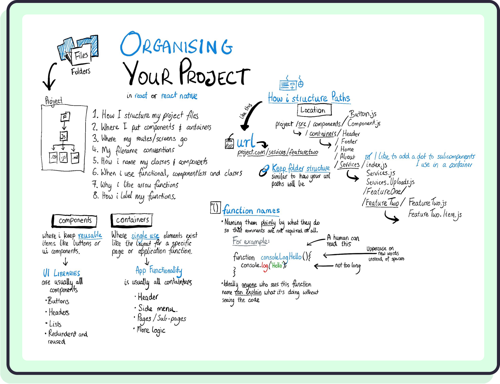

# The Best Practice To Structure And Organize React Application



## Keyword

1. UI Components: Reusable components like button or typography.etc.Components should not contain any business logic.
2. Pages: Page router, each page should correspond to an entry.
3. Modules: Modules like header, toolbar.etc share by pages.
4. Utils: Utility functions.
5. Assets: Static resource like image.etc.
6. Tests: test file folder.

## Project File Structure

```bash
├── global.d.ts        # Global type definition file
├── package.json
├── public             # Public files
├── README.md
├── src                     # Source files
│   ├── assets              # Static files
│   ├── pages               # Page router
│   ├── containers          # Global containers
│   ├── ui                  # UI components
│   ├── modules             # Share modules
│   ├── models              # Global models
│   ├── styles              # Global styles
│   ├── theme.ts            # Theme
│   ├── @types              # Custom type definition
│   └── utils               # Utility functions
└── tsconfig.json      # Typescript configuration file
```

```
└── pages              # Page router
    ├── index.tsx           # Entry
    ├── login               # login
    │     ├── index.tsx           # Entry
    │     └── form
    │          └── index.tsx
    └── dashboard           # dashboard
          └── index.tsx
```

```
└── ui                 # UI components
    ├── button              # Buttons
    │     └── index.tsx
    └── typography          # Typography
          └── index.tsx
```

```
└── modules            # Share modules
    ├── header              # header
    │     └── index.tsx
    └── sidebar             # sidebar
          └── index.tsx
```

## CSS-IN-JS VS CSS Module

1. `CSS-IN-JS `: Compile to unique class name,so do not need to spend much time on considering class name. But it's not good at global style.
2. `CSS Module`: Need to avoid same class name, mean that you need to spend much time on considering class name. It's good at global style and is human-readable.
