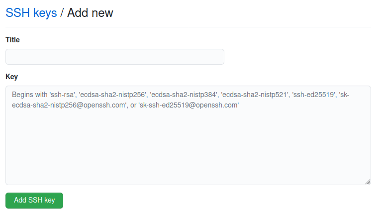

# Git reference

**Git set user**

- Global

  > git config --global user.name username
  > git config --global user.email user@email.com

- Repository
  > git config user.name username
  > git config user.email user@email.com

**SSH**

- Generate ssh key

  > ssh-keygen -t rsa -C user@email.com
  > Type `Enter` till the end.

- Add ssh key to git account

1. Copy ssh key, exec command below and copy all then output text

   > cat id_rsa.pub

2. Open account `Setting`, find the `SSH and GPG keys` menu, then click `New SSH key`, paste the ssh key to the textarea.
   

**Muti account**
If there are A and B:

1. Set A user as global

   > git config --global user.name A
   > git config --global user.email A@email.com

2. Generate A ssh key
   > ssh-keygen -t rsa -C A@email.com


Type `a_id_rsa` as file, if current path are not in the path `/home/$username/.ssh`,then should type `/home/$username/.ssh/a_id_rsa`.Then type `enter` for next steps till the end.(_$username is a variable_)

3. Set A user as global

   > git config --global user.name B
   > git config --global user.email B@email.com

4. Generate B ssh key
   > ssh-keygen -t rsa -C A@email.com


Type `b_id_rsa` as file, if current path are not in the path `/home/$username/.ssh`,then should type `/home/$username/.ssh/b_id_rsa`.Then type `enter` for next steps till the end.(_$username is a variable_)

5. Add config for muti accounts
   Add a config file in the path `/home/$username/.ssh`
   > vi config

```
# github A@gmail.com
host github.com  # alias, as default if you do not change your push or pull url
    Hostname github.com # host
    User a # user name
    IdentityFile ~/.ssh/a_id_rsa  # ssh key path

# github B@email.com
host githubB # alias, should change git url if use this alias
    Hostname github.com
    User B
    IdentityFile ~/.ssh/b_id_rsa
```

_If hosts are different, then alias just use the origin host name, and don't need to change git url.For example, if hosts are github.com and gitlab.com, config like this below and don't need change git url at step 6:_

> vi config

```
# github A@gmail.com
host github.com
    Hostname github.com # host
    User a # user name
    IdentityFile ~/.ssh/a_id_rsa  # ssh key path

# github B@email.com
host gitlab.com
    Hostname gitlab.com
    User B
    IdentityFile ~/.ssh/b_id_rsa
```

6. Change git url
   Change the git url for the B account, assume the origin url is `git@github.com:/b/b.git`
   > git remote set-url origin git@githubB:/b/b.git

OK, everything is done!
